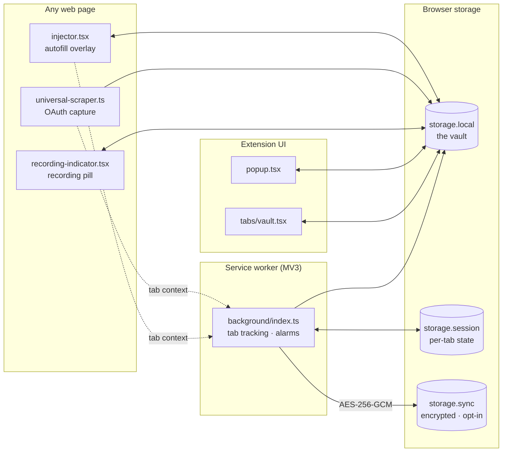
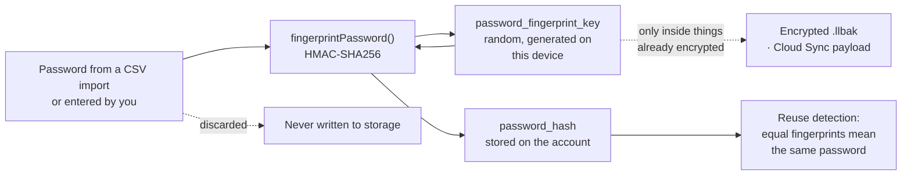

# LoginLens Documentation

LoginLens is a browser extension that answers a question your browser cannot:
*which account did I use here?* It records the identity, OAuth provider and MFA
method behind every site you sign into, and keeps all of it on your machine.

It does not store passwords. See [Privacy & Architecture](./privacy.md) for
exactly what it does store.

## Guides

| Guide | What it covers |
| --- | --- |
| [Installation](./installation.md) | Installing from a release, or building from source |
| [OAuth Recording](./oauth-recording.md) | How sign-ins are captured, and how to stop it |
| [Importing Passwords](./importing.md) | Bringing in a Chrome, Edge, Bitwarden or 1Password export |
| [API Keys Vault](./api-keys.md) | Storing developer secrets, and where they actually live |
| [Privacy & Architecture](./privacy.md) | Every storage key and every network request |
| [Multi-Browser Support](./browsers.md) | The seven build targets and their differences |
| [Sync Schema Tokens](./SYNC_SCHEMA_TOKENS.md) | The minified field names used by sync and backups |
| [Publishing](./publishing.md) | Releasing, and submitting to the Chrome, Edge and Firefox stores |

## Project files

| File | What it covers |
| --- | --- |
| [PERMISSIONS.md](../PERMISSIONS.md) | Why each permission is requested, and which are refused |
| [SECURITY.md](../SECURITY.md) | Reporting a vulnerability |
| [CONTRIBUTING.md](../CONTRIBUTING.md) | Development setup and PR guidelines |
| [CHANGELOG.md](../CHANGELOG.md) | Release history |

All of these are reachable from inside the extension too, under **Settings →
About**, alongside the version you are running. If you are filing a bug, copy
your logs from **Settings → Developer → System Logs** first — they are redacted
before they are written, and they are the fastest way to a diagnosis.

---

## How the pieces fit together

Nothing in this diagram reaches a LoginLens server, because there is not one.
`storage.sync` is the browser vendor's own sync transport, and only ever
receives ciphertext.

## What happens to a password

The fingerprint is keyed, so it cannot be looked up in a rainbow table, and a
fingerprint on its own is meaningless without the key.

The key travels only inside things that are already encrypted: an encrypted
`.llbak` backup, and the Cloud Sync payload. It has to — a vault restored
without it would recompute different fingerprints for the same passwords and
report every account as unique. It is never written into plain `.json` exports.

Restoring a `.llbak`, or pulling from Cloud Sync, adopts the key that produced
the incoming fingerprints, so reuse detection continues unbroken across devices.
