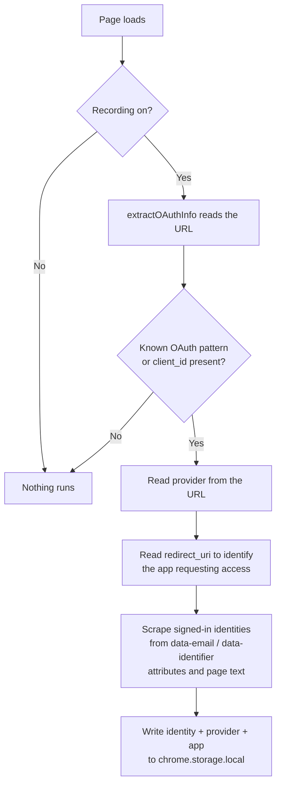

# OAuth Recording

This page explains how LoginLens captures your "Sign in with…" flows, what it
reads while it is doing so, and how to turn it off.

## What OAuth is

OAuth lets you sign into a site using an account you already have — Google,
Apple, GitHub — instead of creating another password. The site you are signing
into never sees your password; it gets a token from the provider.

The cost is that you accumulate connections. LoginLens records which identity
you used on which site, so that list stops being invisible.

---

## The two recording modes

### Manual (default)

1. Open the LoginLens popup and click **Record OAuth Login**.
2. Complete the OAuth sign-in.
3. LoginLens captures the identity and the app that requested access.

While manual recording is on:

- A pill appears at the top of every page you visit, saying LoginLens is
  recording, with a **Stop** button on it.
- Recording **stops by itself after 15 minutes**, whether or not you press stop.
  The deadline is a browser alarm, so closing the popup or restarting the
  browser does not extend it.

### Always record

Vault → **Settings → General → Always Record OAuth Logins**.

Every OAuth flow is captured with no button press. There is no on-page pill in
this mode — it is a standing preference, visible and reversible in Settings,
and a permanent banner on every page would only train you to ignore it.

---

## What happens on the page

The content script is `src/contents/universal-scraper.ts`. It runs on
`http://*/*` and `https://*/*`, top frame only, and does nothing at all unless
one of the two recording switches is on.

Captured data is written to `chrome.storage.local` under `oauth_registry`. That
registry is capped at 500 entries, so a page that renders thousands of synthetic
addresses cannot fill the storage quota and block real writes.

---

## Providers detected by name

| Provider | Matched on |
| --- | --- |
| Google | `accounts.google.com/o/oauth2`, `/signin/oauth`, `/v3/signin` |
| GitHub | `github.com/login/oauth/authorize` |
| Microsoft | `login.microsoftonline.com` with a `client_id` |
| Apple | `appleid.apple.com` with `auth` or a `client_id` |
| X / Twitter | `twitter.com/i/oauth2`, `x.com/i/oauth2` |
| Facebook | `facebook.com/dialog/oauth` |
| Discord | `discord.com/oauth2/authorize` |
| LinkedIn | `linkedin.com/oauth/v2/authorization` |
| Slack | `slack.com/oauth/v2/authorize` |

Anything else with a `client_id` parameter and `oauth`, `authorize` or `auth`
in the URL is captured generically, using the current hostname as the provider.
That catches most enterprise SSO without needing a rule per vendor.

---

## Single-page apps

Many OAuth flows never reload the page. LoginLens watches for navigation using
the Navigation API's `navigatesuccess` event where the browser has it, plus
`popstate`, `hashchange`, and a `MutationObserver` that re-reads
`location.href`.

It deliberately does **not** patch `history.pushState` / `replaceState`: content
scripts run in an isolated world with their own `history` object, so a patch
applied there never observes the page's own calls.

---

## Google Linked Apps scanner

To capture apps you authorised before installing LoginLens:

1. Visit [myaccount.google.com/linkedapps](https://myaccount.google.com/linkedapps).
2. The page is scanned automatically — this handler runs regardless of the
   recording switches, because the page exists only to list your connections.
3. Connected apps are imported and attached to the Google identity shown on the
   page.

---

## Multiple accounts

LoginLens captures every signed-in identity visible during the flow, not just
the first. On Google properties it reads the `data-email` attributes on the
account chips, which is what distinguishes "the account you picked" from "the
accounts you happen to be signed into".

---

## When nothing is captured

- Check that a recording mode is actually on — manual recording expires after
  15 minutes.
- Reload the page and start the sign-in again. On some SPAs the flow begins
  before the content script has initialised.
- Very unusual providers may not match either the named patterns or the generic
  `client_id` fallback. Add the entry by hand from the Vault.
- Nothing is captured inside iframes; the scraper runs on top-level frames only.
